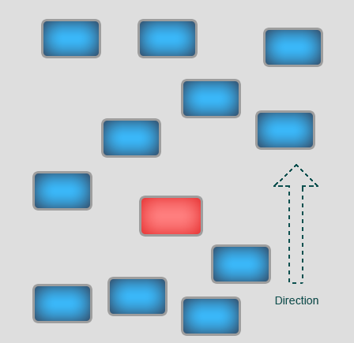
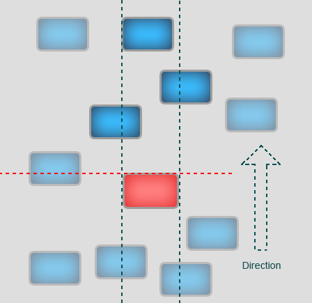
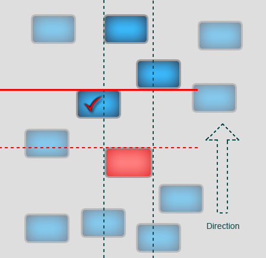
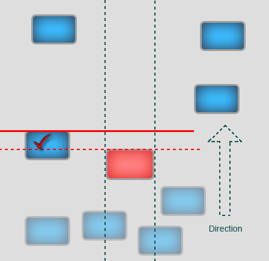
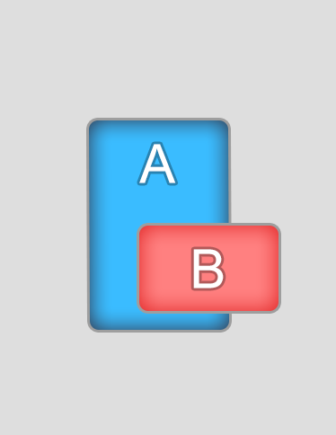

# Element seaching alghorithm

The alghorithm is reasonable for any direction. "Upper edge" means an edge coincident with the movement direction. For the movement up - upper edge, down - bottom edge, right - right edge, left - left edge.   

Example: There are navigation elements, focused element is marked in red. 

User presses the button "Up". The first occuring thing is eliminating of elements that have upper edge lower then upper edge of the focused element. 

The elements that have edges that intersect along the axis perpendicular to the direction are found. If there is any of such element exists then their priority become higher and other elements are eliminated. 

The element that has upper edge closer to the upper edge of the focused element is searched for from the last elements.  

If on the second step intersected elements haven't been found the closest element is found. 

# It's not a bug, it's a feature!

In this example moving vertically from the element **B** to the element **A** it's possible to transit the focus but not vise versaю
It happens because of the bottom edge pf the element **A** is lower then the bottom edge of the element **B**.
So **A**  is higher and lower **B** at the same time. 

