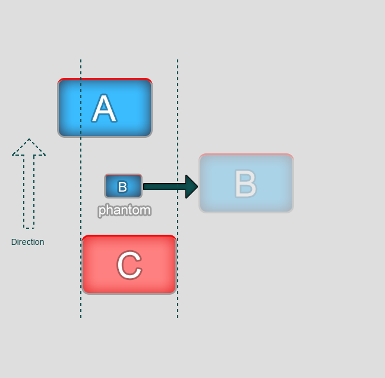

The element searching algorithm can be changed if different behaviour is needed.


# Attribute "user defined"

```
<i class="fav-button nav-item" data-nav_ud="0,0,#pfl_film_watch,0"></i>
```

If the attribute is defined then the navigation stops to use the intelligent element search in some cases. In the above example when the key "DOWN" has been pressed the focus transits to the element #pfl_film_watch.
Edges are defined separated by commas: up, right, down, left


```
<i class="fav-button nav-item" data-nav_ud="0,0,none,0"></i>
```

In this example the key "DOWN" pressing is ignored.

You can also set each side separately

```
<i class="fav-button nav-item" data-nav_ud_up="none"></i>
```

In this example the key "UP" pressing is ignored.

If you set attribute by .data(), it will work too.


# Attribute entry point

The attribute forbidden to enter in the element with specified direction. 

The enter points are defined in the attribute with commas separated 0 and 1.

0 - forbiddens to enter 

1 - allows to enter

The edges are defined in the CSS order - top, right, bottom, left

```
<i class="fav-button nav-item" data-nav_ep="1,1,0,1"></i>
```
In this example it's impossible to enter in the element from the bottom. 


# Phantoms

A phantom is a `nav-item` which transits the focus on the another element as soon as the focus has come to this `nav-item`. It works only for a keyboard. It's ignored when gestures managing realize.
```
<div class="nav-item" data-nav-phantom="#card_owner"></div>
```

In this example when the focus comes to the element it's transited to the element #card_owner.


