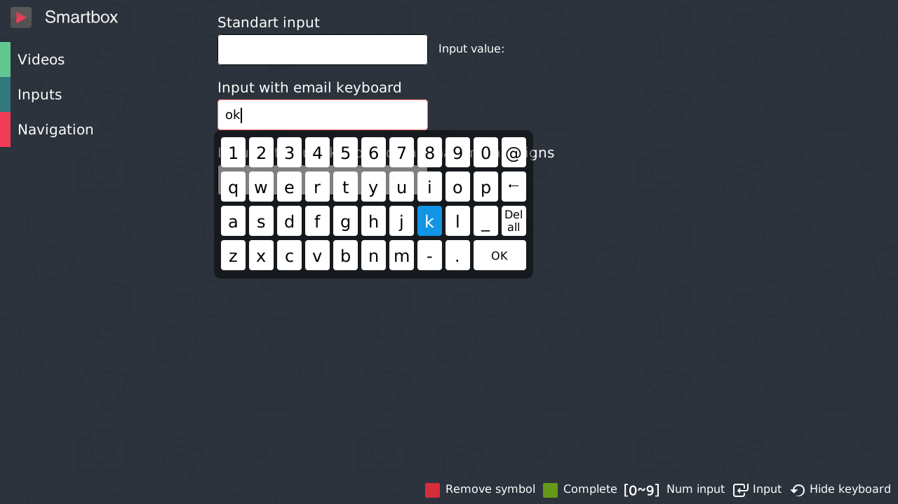
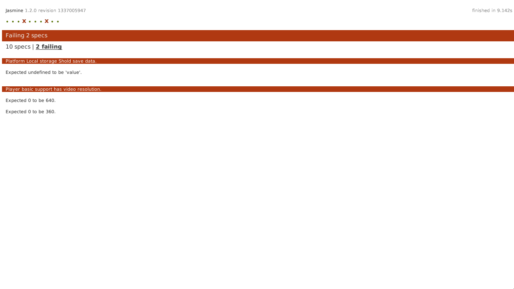

> English documentation will be soon...

# STB Infomir MAG200/250 How-to

## Как запустить демку на устройстве MAG250

* Заходим на устройство по ssh ([инструкция](http://wiki.infomir.eu/doku.php/faq:second_bootloader_mag200_250)). Могут быть проблемы. Если нет доступа до 22-го порта - вам нужно перепрошить устройство на публичную версию (через Bootstarp&USB). Далее входим с паролем `930920`:

```
  ssh root@192.168.0.XXX
```

* Запускаем нашу демку:

```
  killall stbapp
  /usr/share/qt-4.6.0/stbapp -qws -display directfb http://immosmart.github.io/smartbox/demo/demoApp/ &

  killall stbapp
  /usr/share/qt-4.6.0/stbapp -qws -display directfb http://immosmart.github.io/smartbox/ &
```

* Можно сделать скриншот (инструкция http://wiki.infomir.eu/doku.php/stalker:faq). На MAG250 нормально работает только рецепт с fbdump. Правда видео не захватывается.

```
  wget -O /tmp/fbdump.zip http://wiki.infomir.eu/lib/exe/fetch.php/files:fbdump.zip
  unzip /tmp/fbdump.zip -d /tmp && rm /tmp/fbdump.zip
  mv /tmp/fbdump /usr/bin/
  chmod a+x /usr/bin/fbdump

  cd /root
  fbdump ss.3.png

  # Выгружаем как-то так:
  scp root@192.168.0.XXX:/root/ss* .
```

## Скриншоты

### Демка на MAG250



### Прогон тестов



### Видео

[](http://www.youtube.com/watch?v=Wd69d_WsD0Q)
